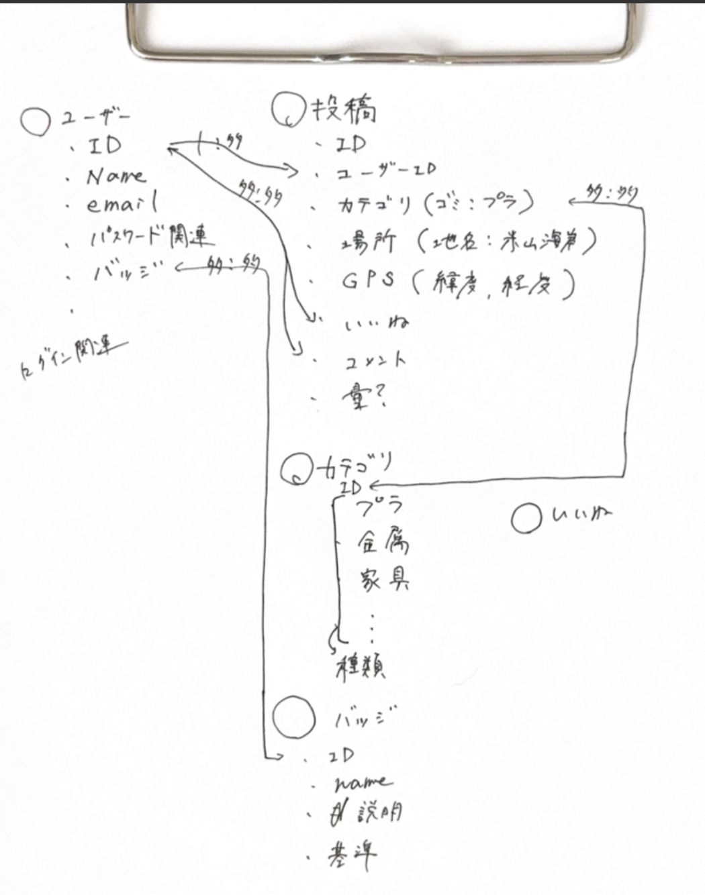

! Railsプロジェクトの立ち上げ
## 構成
ruby 3.2.1
rails 7.0.4.2
postgres latest
# Dockerコマンド
> - docker compose run --rm --no-deps web rails new . --force --database=postgresql
> - docker compose build
> - docker compose run --rm web rails db:create
> - docker compose up

# POI
## やること
 - ゴミ投稿アプリ
    - 写真・位置情報・種類を投稿し、ランキングやマップを通じ、ゴミを可視化。
    - ゴミ削減に向けた意識改革

## 機能

 - 投稿
    - 投稿作成
        > 写真、ごみの種類、位置情報、コメントを投稿
    - 画像アップロード
        > スマホ・PCから画像をアップロード
    - ごみカテゴリを選択
        > 「プラスチック」「金属」「漂流物」など分類

- 閲覧
    - 投稿一覧
        > 最新投稿を表示、カテゴリフィルタあり
    - マップ表示
        > 投稿されたゴミの位置をマップ上に表示
    - 投稿詳細
        > 各投稿の写真・コメント・位置情報を確認
    - ランキング
        > 地域別ランキング(地域別の投稿数)やユーザーランキング(いいね数、投稿数)
    - 統計情報
        > 投稿データの分析、ゴミの種類、量などのデータを表示
    - プロフィール
        > マイページ(投稿履歴、統計データ、etc)、投稿管理

- ゲーミフィケーション
    - バッジ機能
        > 10回投稿で「投稿マスター」などの称号
    - いいね・コメント
        > 他の投稿をいいね。コメントできる。

- 認証
    - ユーザー登録・ログイン
        > メール&パスワード認証

## 要素
