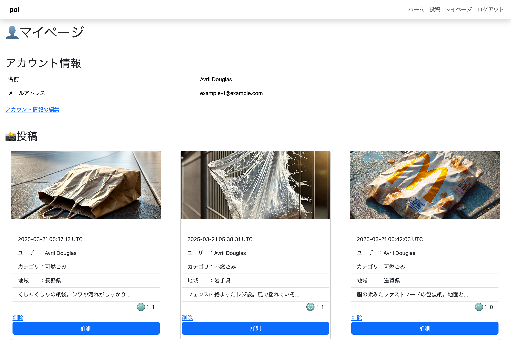
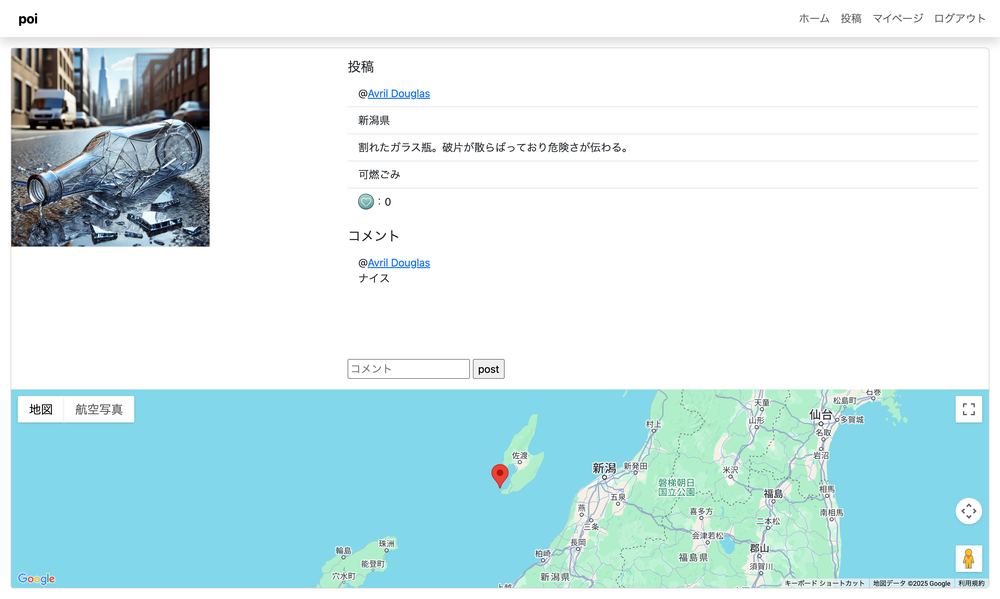
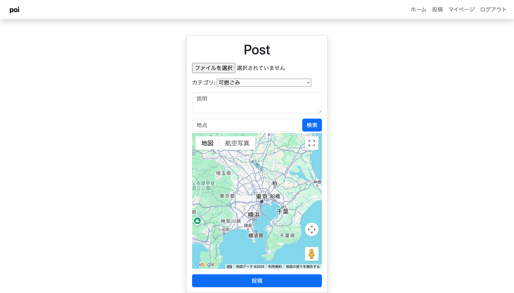
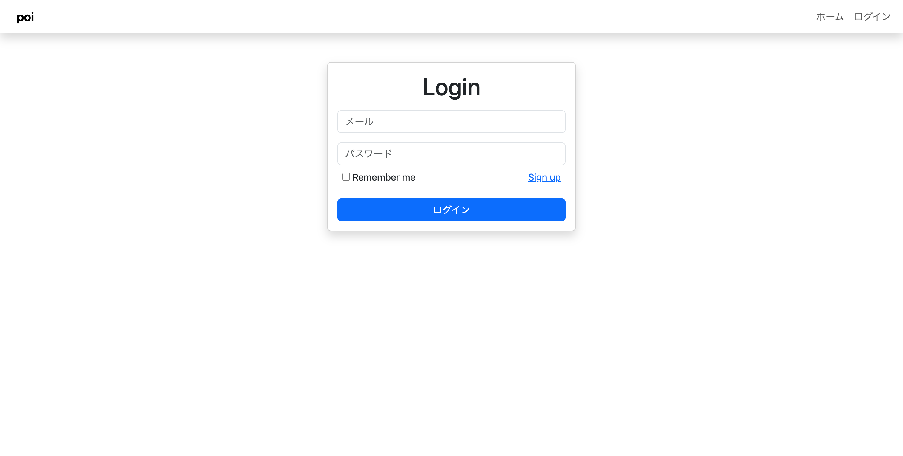
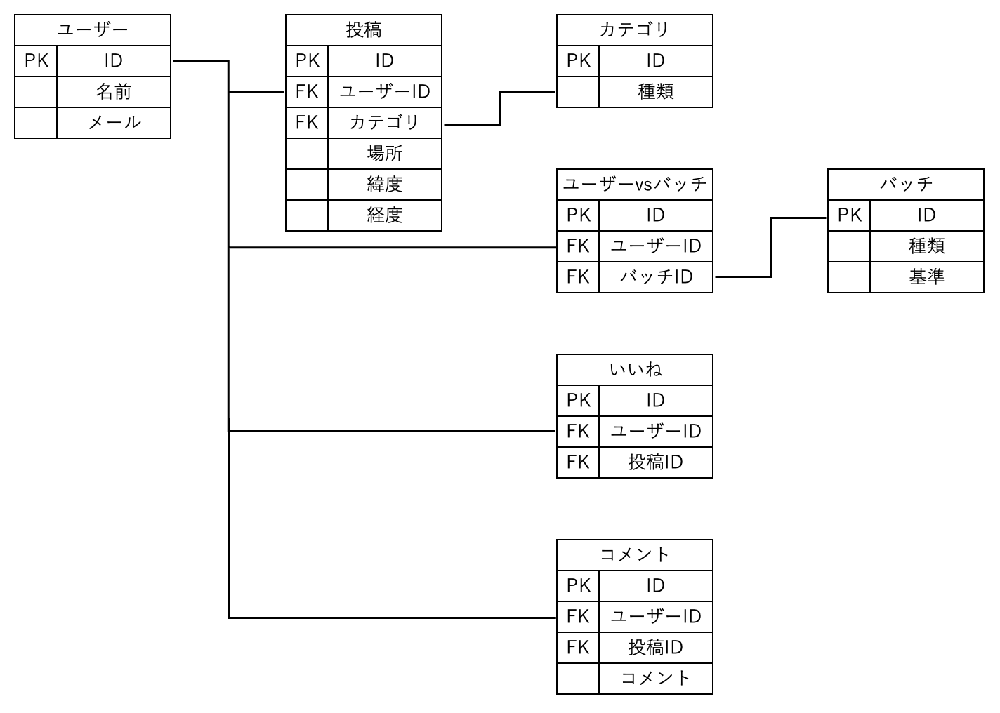
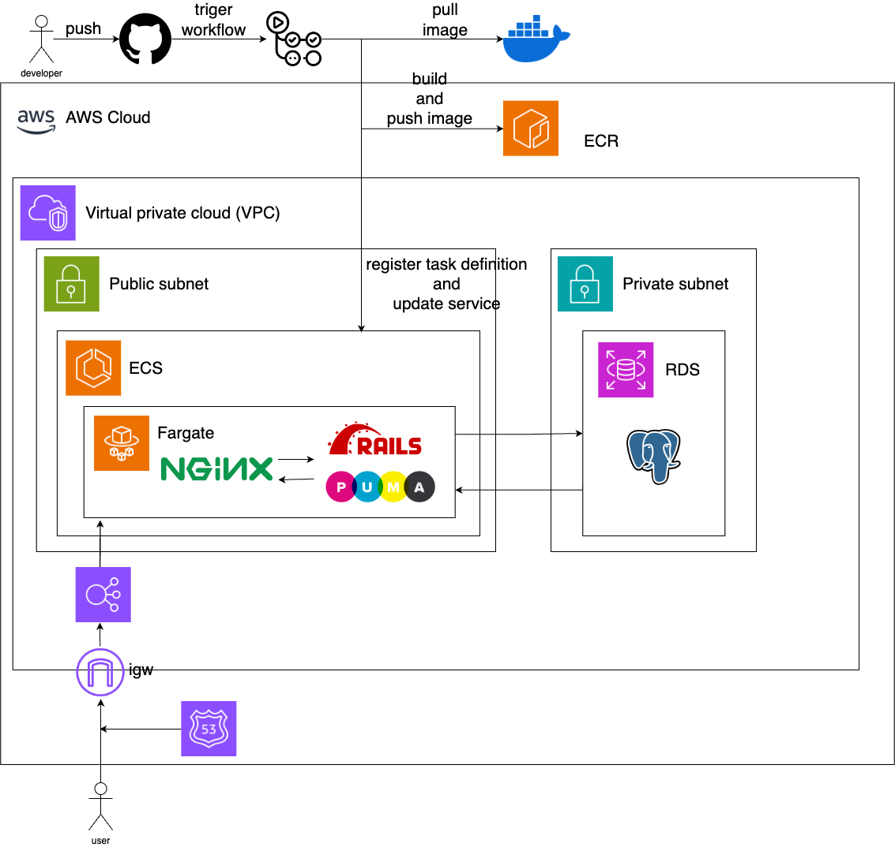

# README
## ポートフォリオ
 - ゴミ投稿サイト
    > 写真・種類・場所・コメントの投稿から、ゴミの見える化を行う。
    > また、ランキングやマップを通じ、ユーザーのゴミ削減に向けた意識改善を行う。

## 機能一覧
 - 投稿
    - 投稿作成
        > 写真、ごみの種類、位置情報、コメントを投稿
    - 画像アップロード
        > スマホ・PCから画像をアップロード
    - ごみカテゴリを選択
        > 「プラスチック」「金属」「漂流物」など分類

- 閲覧
    - 投稿一覧
        > 最新投稿を表示、カテゴリフィルタあり
    - マップ表示
        > 投稿されたゴミの位置をマップ上に表示
    - 投稿詳細
        > 各投稿の写真・コメント・位置情報を確認
    - ランキング
        > 地域別ランキング(地域別の投稿数)やユーザーランキング(いいね数、投稿数)
    - 統計情報
        > 投稿データの分析、ゴミの種類、量などのデータを表示
    - プロフィール
        > マイページ(投稿履歴、統計データ、etc)、投稿管理

- ゲーミフィケーション
    - バッジ機能(未実装)
        > 10回投稿で「投稿マスター」などの称号
    - いいね・コメント
        > 他の投稿をいいね。コメントできる。

- 認証
    - ユーザー登録・ログイン
        > メール&パスワード認証

## 機能画像
|ホーム画面|投稿一覧|
|---|---|
|ゴミ分布マップや円グラフをページの上部に表示することで、新規ユーザーの関心が湧くように設計。ランキングにより、既存ユーザーのモチベーション向上。投稿のトップに画像を表示することで、投稿への関心を高める。いいねボタンからユーザーが互いにモチベーションを向上しあう。|投稿一覧|
|||

|マイページ|投稿詳細|
|---|---|
|マイページ|投稿詳細|
|||

|新規投稿|ログイン|
|---|---|
|新規投稿|ログイン|
|||

# 使用技術
|Category|Technology Stack|
|---|---|
|Frontend|Bootstrap(v5.3.3)|
|Backend|Ruby(v3.2.1), RubyonRails(v8.0.2), Puma(v5.0), Nginx(v1.26)|
|Infrastructure|AWS(ECR/ECS, S3, RDS, VPC)|
|Database|Postgres(v16.3)|
|Environment setup|Docker(v27.3.1)|
|CI/CD|GithubActions|

## 設計
- Userモデル
    - Name = (空はダメ、長さは50文字以内)
    - Email = (空はダメ、長さは255文字以内、メールフォーマットに従うこと、ユニークなアドレス、大小文字に区別なし)
    - Password = (空はダメ、長さは6文字)

## ER図

## システム構成図+s3

